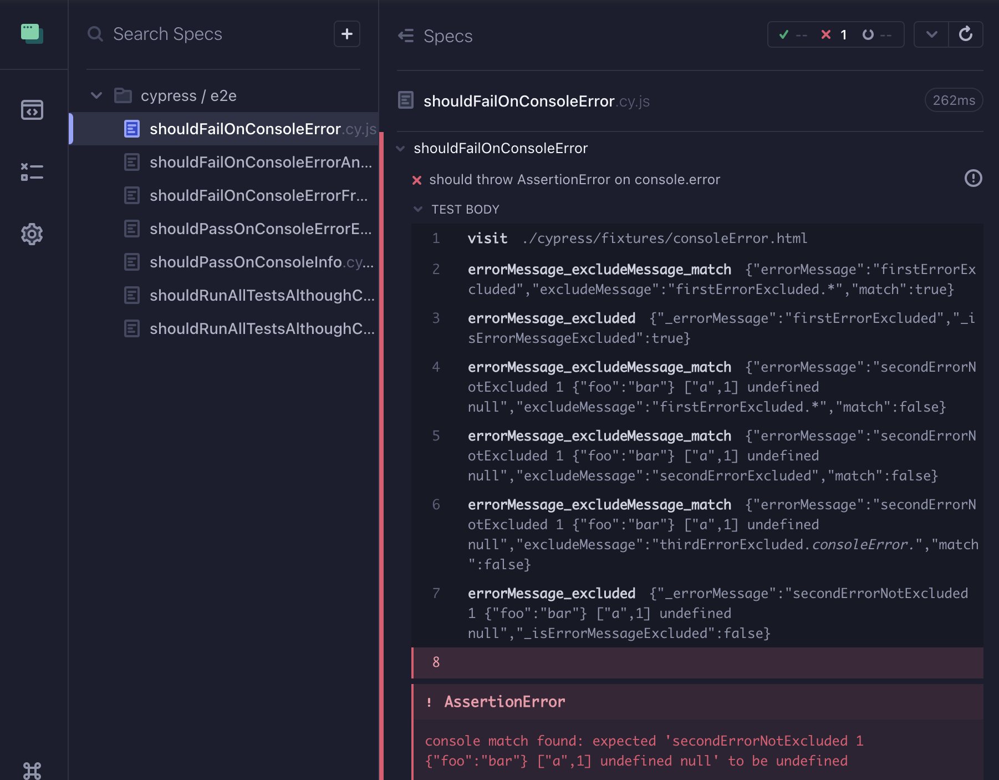

# cypress-fail-on-console-error

This Plugin observes `console.error()` function from [window object](https://developer.mozilla.org/de/docs/Web/API/Window). Cypress test will fail when the error function gets executed.

### Installation

```
npm install cypress-fail-on-console-error --save-dev
```

### Usage

`cypress/support/e2e.js`

```js
import failOnConsoleError from 'cypress-fail-on-console-error';

failOnConsoleError();
```

### Config (optional)

| Parameter             | Default               | <div style="width:300px">Description</div>    |
|---                    |---                    |---                                            |
| `excludeMessages`     | `[]` | Exclude console messages from throwing `AssertionError`. Regular expression parameters are acceptable. String parameters will be interpreted as regular expression. [String.match()](https://developer.mozilla.org/de/docs/Web/JavaScript/Reference/Global_Objects/String/match) will be used for evaluation. Be sure to [escape the string regular expression](https://javascript.info/regexp-escaping) for special characters. When console message property `stacktrace` exists, then the whole stacktrace can be matched. |
| `includeConsoleTypes` | `[consoleType.ERROR]` | Define console types for observation
| `cypressLog`          | `false`               | Enable debug logs for errorMessage_excludeMessage_match and errorMessage_excluded to cypress runner                                     

<br/>

```js
import failOnConsoleError, { consoleType, Config } from 'cypress-fail-on-console-error';

const config: Config = {
    excludeMessages: ['foo', /^some bar-regex.*/],
    includeConsoleTypes: [
        consoleType.ERROR,
        consoleType.WARN,
        consoleType.INFO,
    ],
    cypressLog: true,
};

failOnConsoleError(config);

// excludeMessages[0] matches example console message 'this is a foo message'
// excludeMessages[1] matches example console message 'some bar-regex message'
// includeConsoleTypes observe console types ERROR, WARN and INFO
// cypressLog debug information will be printed to the cypress runner
```

Using Javascript, consoleType Enum can be parsed as number values

```js
failOnConsoleError({
    includeConsoleTypes: [0, 1, 2],
});

// 0 = INFO
// 1 = WARN
// 2 = ERROR
```

### Set config from cypress test 
Use `failOnConsoleError` functions `getConfig()` and `setConfig()` with your own requirements. Detailed example implementation [cypress comands](https://github.com/nils-hoyer/cypress-fail-on-console-error/blob/56753cf3ff9222bb2c452304589ae0cfd5f85b46/cypress/support/e2e.ts#L14-L64) & [cypress test](https://github.com/nils-hoyer/cypress-fail-on-console-error/blob/123e251510045f2eb30c9ec2f6f247b77427d464/cypress/e2e/shouldFailOnConsoleErrorFromSetConfig.cy.ts#L1-L25). Note that the config will be resetted to initial config between tests.

```js
const { getConfig, setConfig } = failOnConsoleError(config);

Cypress.Commands.addAll({
    getExcludeMessages: () => cy.wrap(getConfig().excludeMessages),
    setExcludeMessages: (excludeMessages: (string | RegExp)[]) => 
        setConfig({ ...getConfig(), excludeMessages})
});
```

```js
describe('example test', () => {
    it('should set exclude messages', () => {
        cy.setExcludeMessages(['foo', 'bar']);
        cy.visit('...');
    });
});
```


### Debugging 
When Cypress log is activated, debug information about the matching and exclude process are available from the cypress runner. As a plus, the generated error message string can be verified.


### Contributing
1. Create an project issue with proper description and expected behaviour
2. Provide a PR with implementation and tests. Command `npm run verify` have to pass locally
