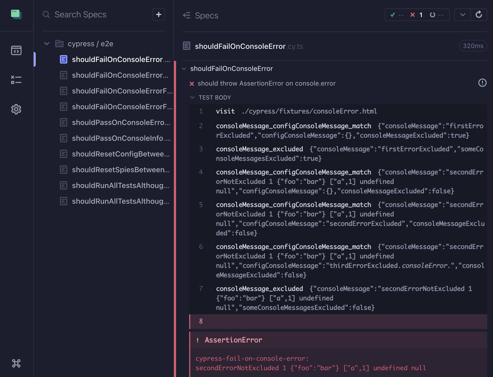

# cypress-fail-on-console-error

This Plugin observes `console.error()` function from [window object](https://developer.mozilla.org/de/docs/Web/API/Window). Cypress test will fail when the error function gets executed. For observing network errors please check out [cypress-fail-on-network-requests](https://www.npmjs.com/package/cypress-fail-on-network-request).

### Installation

```
npm install cypress-fail-on-console-error --save-dev
```

### Usage

`cypress/support/e2e.js`

```js
import failOnConsoleError from 'cypress-fail-on-console-error';

failOnConsoleError();
```

### Config (optional)

| Parameter             | Default               | <div style="width:300px">Description</div>    |
|---                    |---                    |---                                            |
| `consoleMessages`     | `[]` | Exclude console messages from throwing `AssertionError`. Types `RegExp` and `string` are accepted. Strings will be converted to regular expression. [RegExp.test()](https://developer.mozilla.org/en-US/docs/Web/JavaScript/Reference/Global_Objects/RegExp/test?retiredLocale=de) will be used for console message matching. Make sure to [escape special characters](https://javascript.info/regexp-escaping). When console message property `stacktrace` exists, then the whole stacktrace can be matched. |
| `consoleTypes` | `['error']` | Define console types for observation. `error`, `warn` and `info` are accepted values.
| `debug`          | `false`               | Enable debug logs for `consoleMessage_configConsoleMessage_match` and `consoleMessage_excluded` to cypress runner                                     

<br/>

```js
import failOnConsoleError, { Config } from 'cypress-fail-on-console-error';

const config: Config = {
    consoleMessages: ['foo', /^some bar-regex.*/],
    consoleTypes: ['error', 'warn', 'info'],
    debug: false,
};

failOnConsoleError(config);
```

### Set config from cypress test 
Use `failOnConsoleError` functions `getConfig()` and `setConfig()` with your own requirements. Detailed example implementation [cypress comands](https://github.com/nils-hoyer/cypress-fail-on-console-error/blob/main/cypress/support/e2e.ts#L14-L64) & [cypress test](https://github.com/nils-hoyer/cypress-fail-on-console-error/blob/main/cypress/e2e/shouldFailOnConsoleErrorFromSetConfig.cy.ts#L1-L25). Note that the config will be resetted to initial config between tests.

```js
// Simple example implementation
const { getConfig, setConfig } = failOnConsoleError(config);

Cypress.Commands.addAll({
    getConsoleMessages: () => cy.wrap(getConfig().consoleMessages),
    setConsoleMessages: (consoleMessages: (string | RegExp)[]) => 
        setConfig({ ...getConfig(), consoleMessages });
```

```js
describe('example test', () => {
    it('should set console messages', () => {
        cy.setConsoleMessages(['foo', 'bar']);
        cy.visit('...');
    });
});
```


### Debugging 
When Cypress log is activated, debug information about the console messages / config console messages matching and excluding process are available from the cypress runner. As a plus, the generated error message string can be verified.


### Contributing
1. Create an project issue with proper description and expected behaviour
2. NPM command `npm run verify` have to pass locally
3. Provide a PR with implementation and tests 
