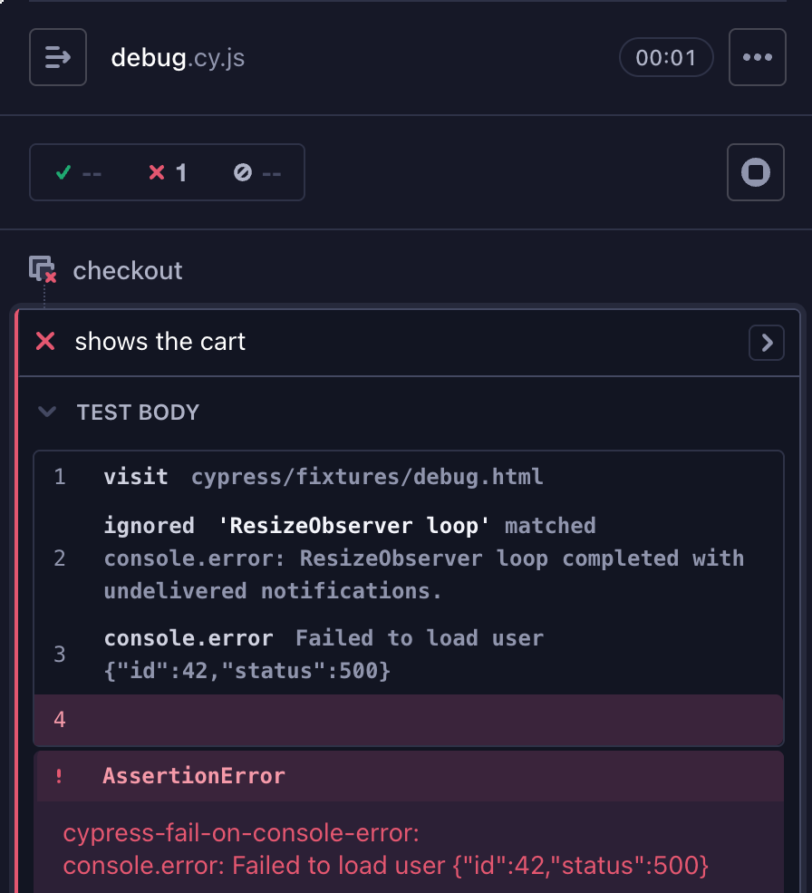

# cypress-fail-on-console-error

[](https://www.npmjs.com/package/cypress-fail-on-console-error)
[](https://github.com/nils-hoyer/cypress-fail-on-console-error/actions/workflows/ci.yml)

Fail Cypress tests when the application under test calls `console.error()`.

The plugin spies on the `console` of the application's [window object](https://developer.mozilla.org/en-US/docs/Web/API/Window). It watches `console.error` by default, and you can configure other console methods too. When a watched method is called with a message that you haven't excluded, the test fails with an `AssertionError`. It works for e2e and component tests.

To fail tests on network errors, see [cypress-fail-on-network-error](https://www.npmjs.com/package/cypress-fail-on-network-error).

## Installation

```sh
npm install cypress-fail-on-console-error --save-dev
```

## Usage

Call `failOnConsoleError()` in your support file: `cypress/support/e2e.js` for e2e tests, `cypress/support/component.js` for component tests, or the `.ts` versions of these files.

```js
import failOnConsoleError from 'cypress-fail-on-console-error';

failOnConsoleError();
```

## Config (optional)

| Parameter                | Default     | Description |
| ------------------------ | ----------- | ----------- |
| `consoleMessages`        | `[]`        | Console messages to ignore. Each entry is a pattern, as `string` or `RegExp`, or `{ type, message }` to ignore a pattern for one console method only, for example `{ type: 'warn', message: /is deprecated/ }`. Strings are converted with `new RegExp(string)`, so [escape special characters](https://javascript.info/regexp-escaping). A string that isn't a valid regular expression throws an error when the config is set. Messages are matched with [`RegExp.test()`](https://developer.mozilla.org/en-US/docs/Web/JavaScript/Reference/Global_Objects/RegExp/test). |
| `includeConsoleMessages` | `[]`        | If set, only console messages that match one of these patterns fail a test. Takes the same entries as `consoleMessages`. Messages that also match `consoleMessages` are still ignored. |
| `consoleTypes`           | `['error']` | Console methods to watch: `error`, `warn`, `info`, `debug`, `trace`, `table`, `log` or `assert`. `assert` only counts failed assertions, and its message is `Assertion failed: ` followed by the arguments after the condition. |
| `debug`                  | `false`     | Log how each console message was matched to the Cypress command log. See [Debugging](#debugging). |

`failOnConsoleError()` and `setConfig()` check the config and throw an error that names the invalid option, for example `cypress-fail-on-console-error: consoleTypes[1] must be one of error, warn, info, debug, trace, table, log, assert, got "warning"`.

```ts
import failOnConsoleError, { Config } from 'cypress-fail-on-console-error';

const config: Config = {
    consoleMessages: [
        'foo',
        /^bar-regex.*/,
        // ignore this warning, but not a console.error with the same text
        { type: 'warn', message: /is deprecated/ },
    ],
    consoleTypes: ['error', 'warn'],
};

failOnConsoleError(config);
```

To fail only on some messages, list them in `includeConsoleMessages`:

```ts
failOnConsoleError({
    consoleTypes: ['error', 'warn'],
    // fail on every console.error, and on warnings that mention React
    includeConsoleMessages: [
        { type: 'error', message: /.*/ },
        { type: 'warn', message: /React/ },
    ],
});
```

### How messages are matched

- All arguments of a console call are joined with spaces into one message. Non-string arguments are converted with `JSON.stringify`. For example, `console.error('failed', 1, { foo: 'bar' })` becomes `failed 1 {"foo":"bar"}`. Circular references become `"[Circular]"` and BigInts become `"10n"`.
- If an argument is an `Error`, its name, message and stack trace are used, so your patterns can match the error name, the message or the file it came from.
- The plugin checks after each Cypress command. If any message since the last check isn't ignored, the test fails with every such message, in the order the application logged them, each after the name of its console method:

    ```
    AssertionError: cypress-fail-on-console-error:
    console.error: Failed to load resource
    console.warn: Each child in a list should have a unique "key" prop.
    ```

## Set config from a Cypress test

`failOnConsoleError()` returns `getConfig()` and `setConfig()`, which let you change the config inside a test. After each test, the config goes back to the one passed to `failOnConsoleError()`.

To change the ignored messages from a test, pass the result to `addConsoleMessagesCommands()`. It adds these Cypress commands:

| Command                                    | Description |
| ------------------------------------------ | ----------- |
| `cy.getConsoleMessages()`                  | Yields the current `consoleMessages`. |
| `cy.setConsoleMessages(consoleMessages)`   | Replaces `consoleMessages`. |
| `cy.addConsoleMessages(consoleMessages)`   | Adds patterns to `consoleMessages`. |
| `cy.deleteConsoleMessages(consoleMessages)` | Removes patterns from `consoleMessages`. A pattern is removed if it is the same kind (`string`, `RegExp` or `{ type, message }`) with the same text, flags and console method. |

```ts
import failOnConsoleError, {
    addConsoleMessagesCommands,
} from 'cypress-fail-on-console-error';

addConsoleMessagesCommands(failOnConsoleError(config));
```

```ts
describe('example test', () => {
    it('should ignore console messages that contain foo or bar', () => {
        cy.addConsoleMessages(['foo', /bar/]);
        cy.visit('...');
    });
});
```

The commands are opt-in, so they can't replace commands with the same names that you added yourself. Their TypeScript declarations come with the package. To change other options from a test, write your own commands with `getConfig()` and `setConfig()`:

```ts
const { getConfig, setConfig } = failOnConsoleError(config);

Cypress.Commands.add('setConsoleTypes', (consoleTypes) =>
    setConfig({ ...getConfig(), consoleTypes })
);
```

In TypeScript, [declare your commands](https://docs.cypress.io/app/tooling/typescript-support#Types-for-Custom-Commands) on `Cypress.Chainable`.

## Debugging

Each console message that fails a test appears in the Cypress command log under the name of its console method, for example `console.error`. Click the entry to print the original arguments to the browser console, where you can inspect logged objects.

Set `debug: true` to log each match between a console message and your `consoleMessages` to the Cypress command log. Click an entry to print its details to the browser console. You can use this to check your patterns and to see the error message a test would fail with.



## Contributing

1. Open an issue that describes the problem and the expected behaviour.
2. Install dependencies with `npm ci`. The e2e and component tests run Cypress in Chrome, so Chrome must be installed.
3. Make your change in `src/index.ts` and run `npm run build`. The tests run against `dist/`, which is committed.
4. Run `npm run verify` (build, type check, format check, unit, e2e and component tests). It must pass.
5. Open a PR with the implementation and tests. Don't change the version in `package.json`: the maintainer releases from GitHub Actions, which increases the version.
